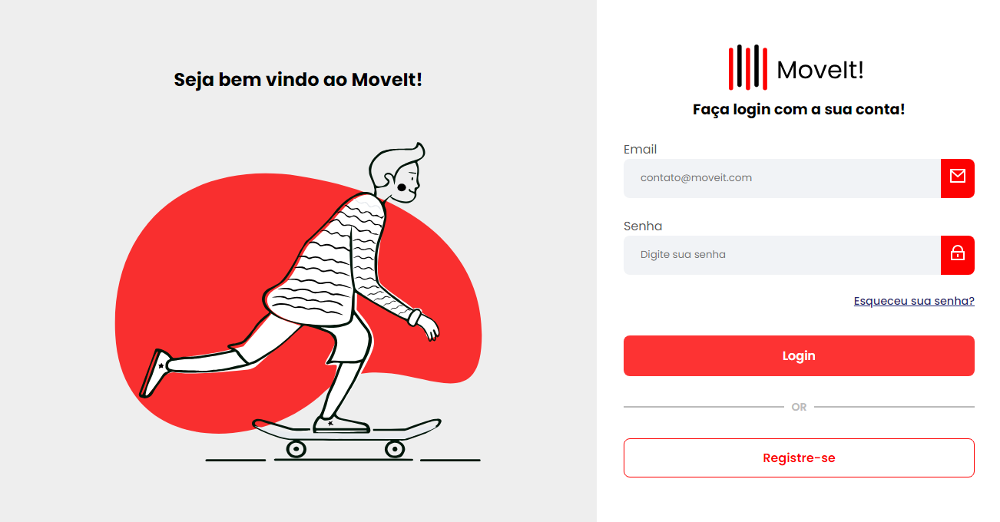

  

# Angular Login

This is a project for a simple login and registration page inspired by <a href="https://github.com/Fernanda-Kipper" target="_blank"> Fernanda Kipper</a> video. In it, she shows how to create an app in Angular with authentication and integrate it with the backend.

## Tech Stack

## Getting Started

1. **Prerequisites**: `NodeJS, Git 1, Angular CLI`
2. **Cloning**: `git clone https://github.com/RodriguesGS/AngularLogin.git`
3. **Start Developing**: `cd project-name & npm run start`

## Application Routes

Here you can list the main routes of your API, and what are their expected request bodies.
​
| route               | description                                          
|----------------------|-----------------------------------------------------
| <kbd>/signup</kbd>     | Page to sign up
| <kbd>/login</kbd>     | Page to login
| <kbd>/user</kbd>     | Protected page that only logged in users can access

## Contribute

1. **Clone project**: `git clone https://github.com/RodriguesGS/AngularLogin.git`
2. **Create feature/branch**: `git checkout -b feature/NAME`